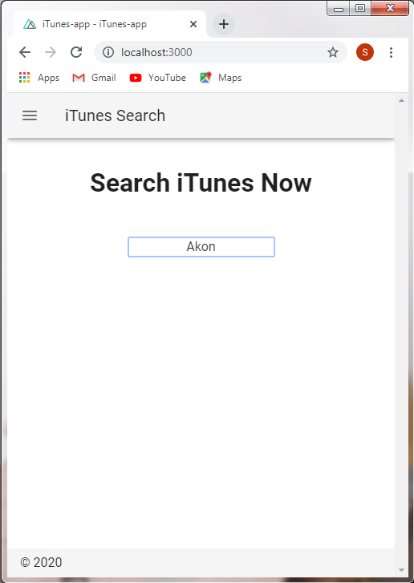
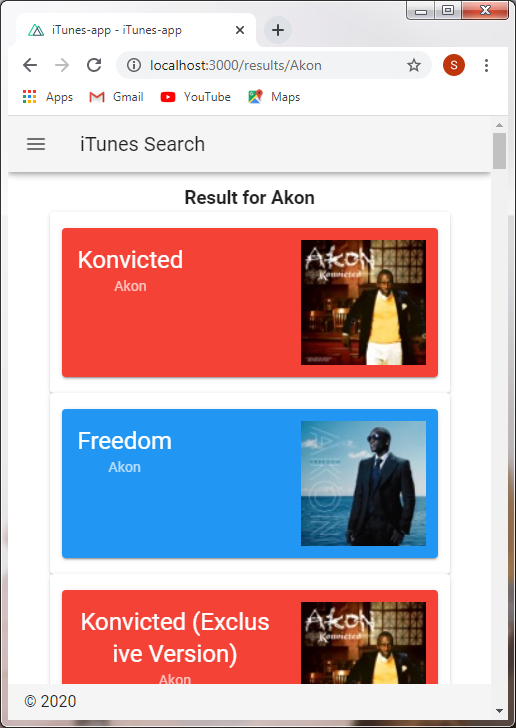
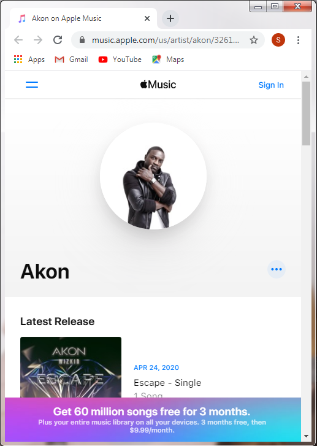

# iTunes-app

> Mobile first web application to search iTunes using Nuxt js and Vuetify.

## Preview




## Build Setup

```bash
# install dependencies
$ npm install

# serve with hot reload at localhost:3000
$ npm run dev

```

For detailed explanation on how things work, check out [Nuxt.js docs](https://nuxtjs.org).
